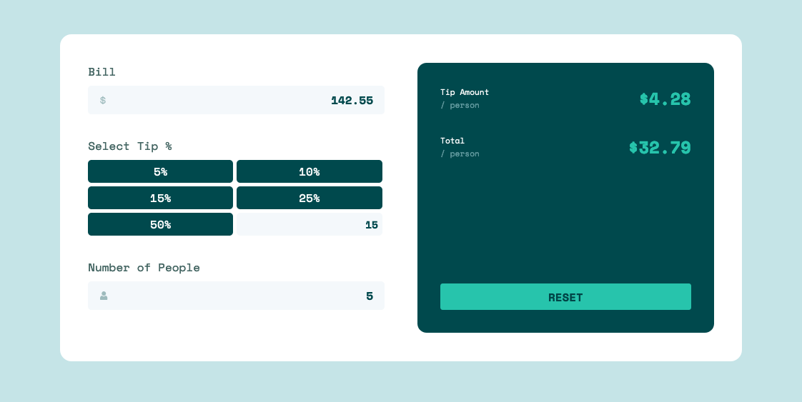

# Frontend Mentor - Tip calculator app solution

This is a solution to the [Tip calculator app challenge on Frontend Mentor](https://www.frontendmentor.io/challenges/tip-calculator-app-ugJNGbJUX).

## Table of contents

- [Overview](#overview)
  - [The challenge](#the-challenge)
  - [Screenshot](#screenshot)
  - [Links](#links)
- [My process](#my-process)
  - [Built with](#built-with)
  - [What I learned](#what-i-learned)
- [Author](#author)

## Overview

### The challenge

Users should be able to:

- View the optimal layout for the app depending on their device's screen size
- See hover states for all interactive elements on the page
- Calculate the correct tip and total cost of the bill per person

### Screenshot

### Links

- [Solution URL](https://github.com/geeky-amat/tip-calculator-app-react)
- [Live Site URL](https://geeky-amat.github.io/tip-calculator-app-react/)

## My process

### Built with

- Semantic HTML5 markup
- Flexbox
- CSS Grid
- Mobile-first workflow
- [React](https://reactjs.org/) - JS library
- [Styled Components](https://styled-components.com/) - For styles

### What I learned

- By default some browsers set the opacity value of placeholder text less than unity.
- There is a pseudo class called 'focus-within' which can be used to focus the div containing say a button element.
- Used css animation and for the specific use case it was implemented, css transition was not doing the work.
- Used event delegation and data attribute.
- Used the useRef hook to select a div element.
- Even for margin-top given in percentage, the percentage is with respect to the containing block's width and not the height.

### Continued development

- There are places where I didn't provide the correct type of the object/variables such as when using the useRef hook. I have to give the correct type.
- When I give some input in say the total bill field then the cursor comes to the left of the input and the new input is placed at the right. Moreover, the decimal initially comes to the leftmost part and moves to correct place after other digit is input after the decimal. Look up the reason for this behavior.
- Modify the logic for the custom tax input field so that it does not take more than one period as input.

## Author

- Frontend Mentor - [@geeky-amat](https://www.frontendmentor.io/profile/geeky-amat)
- Twitter - [@GeekyAmat](https://www.twitter.com/GeekyAmat)
